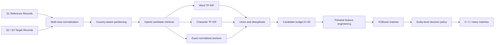

# Amazon ML Challenge 2026

## Business Entity Resolution at Scale

> An evidence-driven, precision-first entity resolution system designed to match noisy business records across multiple data sources without comparing every possible pair.

[](https://www.python.org/)
[](submission_package/code/business_entity_resolution/tests/)
[](models/)
[](docs/Amazon_ML_Challenge_2026_Complete_Architecture.md)
[](#)

---

## Project highlight

This project solves a difficult record-linkage problem: identify which records from noisy business data sources refer to the same real-world entity as each reference record.

The naïve search space contains approximately **22.77 trillion possible comparisons**. The final architecture reduces that space to a compact, auditable candidate set and then applies a high-precision machine-learning decision layer.

### Key achievements

| Achievement | Result |
|---|---:|
| Primary Word TF-IDF retrieval recall | **98.81%** |
| Hybrid candidate recall on evaluated cohort | **99.31%** |
| Production candidate recall at `K=30` | **98.35%** |
| Production Macro F<sub>0.5</sub> at `K=30` | **0.9639** |
| High-recall Macro F<sub>0.5</sub> at `K=50` | **0.9649** |
| Candidate reduction | **~22.77T comparisons → ~600K candidates** |
| Automated test suite | **29 tests passing** |

The recommended production operating point is **`K=30`**: it preserves strong recall while generating approximately **36% fewer candidates than `K=50`**.

---

## Why this project is interesting

Business records are rarely clean identifiers. The same company may appear with:

- Different legal suffixes: `Pvt Ltd`, `Private Limited`, `Ltd.`
- Transliteration and cross-script variation
- Misspellings, OCR noise, and abbreviated names
- Reordered or partially missing addresses
- Different postal formats and house-number conventions
- Multiple valid matches across source systems

The challenge is therefore not simply classification. It is a complete retrieval-and-decision system where **candidate generation directly affects final quality and operational cost**.

---

## System architecture



### 1. Multi-view normalization

The normalization layer creates robust representations for names and addresses using:

- Unicode normalization
- Transliteration with `anyascii`
- Legal-entity canonicalization
- Abbreviation handling
- Token and compact representations
- Structured extraction of postal codes and house numbers

### 2. Hybrid candidate retrieval

Rigid blocking rules created a low recall ceiling, so the system uses a country-partitioned hybrid retriever:

1. **Word-level TF-IDF** over normalized name and address — primary retrieval engine
2. **Character n-gram TF-IDF** — recovers spelling, transliteration, and address variations
3. **Exact normalized anchors** — preserves high-confidence lexical matches
4. **Union and deduplication** — combines channels before applying the candidate budget

### 3. Feature-based matching

Each candidate pair is scored with lexical, structural, and retrieval-context features, including:

- Name and address Levenshtein similarity
- Jaro-Winkler similarity
- Token Jaccard and overlap
- Exact normalized matches
- Postal-code agreement
- House/building-number agreement
- Address availability and missingness indicators
- Retrieval cosine score

### 4. Entity-level decision policy

The model outputs pair probabilities, which are converted into the required `0 / 1 / many` entity-level predictions using a precision-oriented threshold policy. This is important because a reference entity may legitimately match multiple records.

---

## Benchmark results

The candidate-budget sweep made the central engineering trade-off measurable:

| Candidate budget | Candidate recall | Candidate precision | Macro F<sub>0.5</sub> | Decision |
|---:|---:|---:|---:|---|
| `K=10` | 92.75% | 31.98% | 0.9466 | Too restrictive |
| `K=20` | 95.37% | 16.44% | 0.9541 | Sub-optimal recall |
| **`K=30`** | **98.35%** | **11.30%** | **0.9639** | **Production baseline** |
| `K=40` | 98.95% | 8.54% | 0.9646 | Marginal gain |
| `K=50` | 99.29% | 7.29% | 0.9649 | High-recall variant |

### What the experiments proved

- Word TF-IDF is a stronger primary retriever than rigid exact blocking.
- Character retrieval and exact anchors provide useful recall improvements without requiring neural embeddings.
- Increasing `K` beyond 30 produces diminishing returns.
- A score-margin constraint hurts multi-match entities and was rejected.
- Fixed top-1 matching is inappropriate because entity cardinality varies.
- Specialist phonetic and missing-address channels added complexity and candidate bloat for negligible final-score gains.

The repository includes the diagnostic evidence behind these decisions in [`reports/`](reports/) and [`docs/`](docs/).

---

## Repository structure

```text
.
├── code/
│   └── business_entity_resolution/       # Core reusable pipeline
├── submission_package/                   # Publishable competition package
├── diagnostics/                          # Profiling and evaluation scripts
├── reports/                              # Benchmark results and analysis artefacts
├── models/                               # Trained matcher artefacts
├── notebooks/                            # Experiment notebooks
├── scripts/                              # Optimization and utility scripts
├── docs/                                 # Architecture and research documentation
├── .gitignore                            # Excludes datasets, caches, archives, outputs
└── README.md
```

Generated predictions, competition datasets, caches, and local archives are intentionally excluded from version control.

---

## Quick start

### Install dependencies

```bash
cd submission_package/code/business_entity_resolution
pip install -r requirements.txt
```

### Run the pipeline

```bash
python src/pipeline.py \
  --data-dir <path-to-dataset>/test \
  --train-dir <path-to-dataset>/train \
  --output-dir <path-to-output> \
  --k 30
```

Use `--k 50` when prioritizing recall over candidate volume. Use `--mode retrain` to retrain the matcher from the available training data.

### Run the tests

From the repository root:

```bash
python -m pytest submission_package/code/business_entity_resolution/tests -q
```

---

## Reproducibility

The project is organized so that the core method can be inspected and reproduced independently:

- Pipeline implementation: [`submission_package/code/business_entity_resolution/`](submission_package/code/business_entity_resolution/)
- Architecture specification: [`docs/Amazon_ML_Challenge_2026_Complete_Architecture.md`](docs/Amazon_ML_Challenge_2026_Complete_Architecture.md)
- Empirical recommendation: [`reports/architecture_recommendation.md`](reports/architecture_recommendation.md)
- Benchmark tables: [`reports/`](reports/)
- Trained model: [`models/xgboost_matcher.joblib`](models/xgboost_matcher.joblib)

The original competition dataset and large generated prediction files are not committed because they are unnecessary for source review and exceed practical repository limits.

---

## Engineering principles

This project emphasizes:

- **Evidence over intuition** — architectural choices are backed by measured retrieval and end-to-end results.
- **Precision-aware optimization** — Macro F<sub>0.5</sub> rewards reliable predictions and penalizes false positives.
- **Scalable retrieval** — candidate generation is treated as a first-class production concern.
- **Open-set robustness** — country partitioning is data-driven rather than hard-coded to the training countries.
- **Auditable decisions** — candidate pairs, feature logic, reports, and output validation are explicit.
- **Practical deployment** — classical sparse retrieval and tree-based matching provide a strong accuracy-to-complexity trade-off.

---

## Acknowledgements

Built as a competition-focused research and engineering project for the **Amazon ML Challenge 2026**, combining exploratory analysis, retrieval experimentation, model benchmarking, and production-oriented packaging.

