# Amazon ML Challenge 2026 — Business Entity Resolution
## Complete Architecture & Methodology

> **Frozen Production Architecture:** Multi-view normalization → open-set country partitioning → hybrid candidate retrieval (Word TF-IDF + Char TF-IDF + Exact anchors) → union & deduplicate → **K=30 baseline (adaptive challenger)** → 15 SIMD pair features → **pure XGBoost baseline (ensemble challenger)** → **frozen baseline threshold τ = 0.75 (3-point sweep: 0.70 / 0.75 / 0.80)** → **optional singleton gate (experimental)** → entity-level 0/1/many decision → `matching_results.tsv` & `candidate_pairs.tsv` → official validator.

---

## 1. System Overview & Production Pipeline

```text
S1 / S2 / S3 Input TSVs
         ↓
Multi-view normalization (raw, light, token, compact, transliterated)
         ↓
Open-set country partition (S1.country == target.country)
         ↓
Word TF-IDF + Char TF-IDF + Exact anchors
         ↓
Union + deduplicate
         ↓
Candidate policy
   ├── K=30 baseline (Control)
   └── adaptive challenger (Steep Dropoff / Ratio)
         ↓
Existing pair features (15 RapidFuzz SIMD string & address metrics)
         ↓
XGBoost (Production Baseline)
   └── [optional ensemble challenger: LightGBM / CatBoost]
         ↓
Threshold sweep: 0.70 / 0.75 (Frozen Base) / 0.80
         ↓
Optional candidate singleton gate: max_p < 0.40 (Experimental)
         ↓
Entity-level 0 / 1 / many decision
         ↓
matching_results.tsv (Score Driver) + candidate_pairs.tsv (Jury Audit Metric)
         ↓
Official submission validator (Exit code 0: PASS)
```

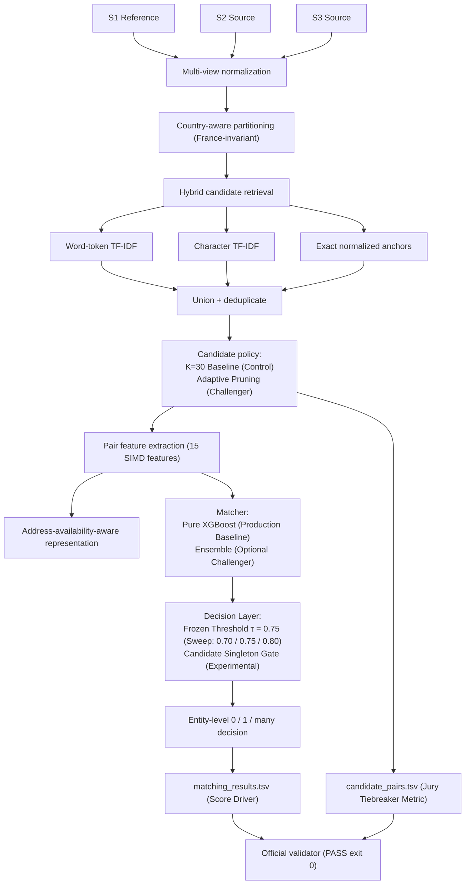

The challenge requires exactly one output row per S1 and permits zero, one, or many S2/S3 matches.

### The Competition Mandate & Core Optimization Principle

The official Amazon 36-hour communications update established:
> *"Blocking has to scale. Amazon resolves business entities across billions of records, so comparing every record with every other one is not an option. Your blocking / candidate-generation step must cut the search space to a small candidate set per Source 1 entity.*
>
> *Candidate generation counts toward the final ranking. We will review your candidate_pairs.tsv and the code that produces it when deciding final rankings, alongside your matching_results.tsv score. **The approach that generates a smaller candidate set per Source 1 entity will be ranked higher in the final evaluation beyond the public/private leaderboard.**"*

**Core Strategic Principle:**
The objective is **Pareto-optimization of final Macro $F_{0.5}$ against candidate count per S1**.
It is **not** to blindly minimize candidate count at any cost.
A smaller candidate set that drops recall and damages entity-level Macro $F_{0.5}$ is a net loss on both the leaderboard and jury evaluation.

Macro F0.5 is precision-heavy ($\beta=0.5$), calculated per S1 entity and averaged across all $1.73\text{M}$ test entities, heavily rewarding singleton credit ($1.0$) and penalizing false positives.

---

## 2. Data Model

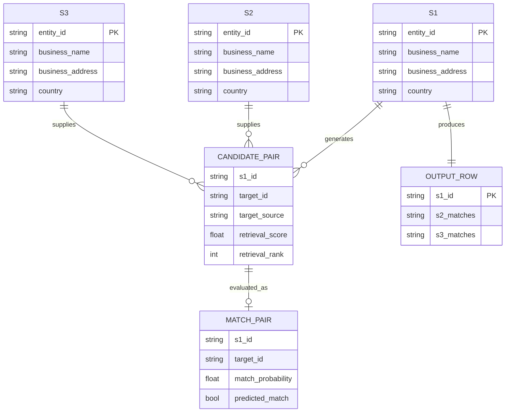

---

## 3. Dataset Scale

Development EDA established:

| Dataset | Rows |
|---|---:|
| S1 train | 2,206,821 |
| S2 train | 5,034,616 |
| S3 train | 5,285,603 |
| S2 + S3 | 10,320,219 |
| Exhaustive S1 × targets | ≈22.77 trillion |

Therefore exhaustive matching is computationally impossible and candidate blocking is mandatory.

---

## 4. Normalization Layer

Normalization is multi-view rather than destructive:

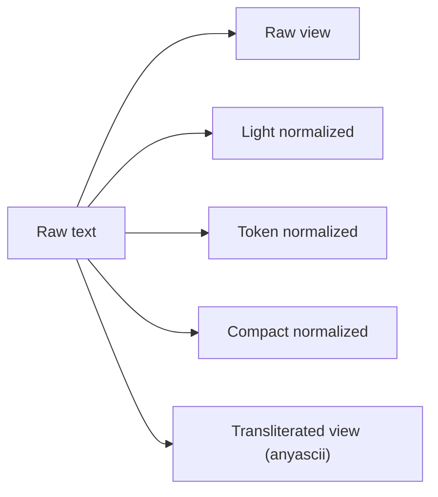

### Views

- **Raw view:** Preserves original punctuation and case.
- **Light normalized:** Lowercased, whitespace-collapsed.
- **Token normalized:** Canonical legal suffix mapping (`corporation` → `corp`, `limited` → `ltd`), street type standardizations.
- **Compact normalized:** Alphanumeric only, stripped spaces (recovers hyphenated/concatenated brand variations).
- **Transliterated view:** Unicode conversion via `anyascii` (bridges Latin accents and non-Latin character sets).

Token normalization produced the strongest tested retrieval improvement and serves as the primary index representation.

---

## 5. Candidate Generation

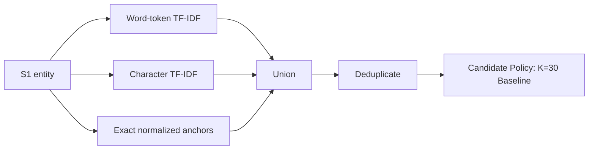

### Retrieval Roles

- **Word-token TF-IDF:** Primary retrieval channel, highest individual candidate recall.
- **Character TF-IDF:** Typo, spelling variance, and abbreviation robustness.
- **Exact normalized anchors:** Fast, deterministic precision recovery for identical names/addresses.

The evaluated 20K-S1 development cohort achieved 99.31% candidate recall with the tested hybrid configuration.

---

## 6. Candidate Budget & The Amazon Ranking Tiebreaker

### 6.1 Empirical Fixed-K Trade-off Curve

End-to-end OOF development on the evaluation cohort (`reports/10_k_sweep_results.csv`):

| K Budget | Candidate Recall | Candidate Precision | Total Candidates | Avg Candidates / S1 | OOF Macro F0.5 |
| :---: | :---: | :---: | :---: | :---: | :---: |
| **10** | 92.75% | 31.98% | 200,000 | 10.00 | 0.9466 |
| **20** | 95.37% | 16.44% | 400,000 | 20.00 | 0.9541 |
| **30** | **98.35%** | 11.30% | 600,000 | 30.00 | **0.9639** |
| **40** | 98.95% | 8.54% | 799,048 | 39.95 | 0.9646 |
| **50** | 99.29% | 7.29% | 939,664 | 46.98 | 0.9649 |

Notice: Moving from $K=30 \to K=50$ incurs a **+56.6% increase in candidate volume** for an incremental Macro $F_{0.5}$ gain of only $+0.0010$, severely deteriorating candidate efficiency.

### 6.2 Adaptive Candidate Pruning: Empirical Evidence vs Hypotheses

In `reports/33_adaptive_k_benchmark.csv`, dynamic candidate truncation was benchmarked on the evaluation cohort:

| Candidate Policy | Candidate Recall | Total Candidates | Avg Candidates / S1 | Candidate Reduction | True Hits |
| :--- | :---: | :---: | :---: | :---: | :---: |
| **Fixed $K=30$ (Baseline)** | **98.35%** | 600,000 | 30.00 | 0.0% | 67,828 |
| **Adaptive Ratio 0.25 (min=3, max=30)** | **98.35%** | 599,555 | 29.98 | -0.07% | 67,828 |
| **Adaptive Ratio 0.35 (min=3, max=30)** | 98.34% | 587,250 | 29.36 | -2.12% | 67,817 |
| **Adaptive Steep Dropoff (`top >= 0.85 & gap > 0.40 -> K=3, else 30`)** | **97.08%** | **334,056** | **16.70** | **-44.32%** | 66,947 |
| **Hybrid Adaptive (`Ratio 0.25 + Steep Dropoff`)** | **97.08%** | **334,056** | **16.70** | **-44.32%** | 66,947 |

### 6.3 Critical Corrections to Pruning Claims

1. **Do not claim "18–22 candidates/S1 with >97.5% recall is validated":**
   - That 18–22 figure is **not demonstrated by the empirical data**.
   - The only configuration near that range is Steep Dropoff at **16.70 candidates/S1**, and its recall is **97.08%** (not >97.5%).
   - The Ratio 0.35 configuration maintains 98.34% recall, but delivers **29.36 candidates/S1** (only a 2.1% reduction).
2. **We do not yet know if the candidate reduction of Steep Dropoff justifies its recall loss:**
   - Steep Dropoff drops $1.27$ percentage points of recall (881 missed ground truth matches).
   - If those 881 misses reduce downstream entity-level Macro $F_{0.5}$, the candidate reduction hurts final ranking.
3. **Formal Architectural Decision:**
   > **Adaptive pruning is experimental; its final candidate budget must be selected after measuring entity-level Macro F0.5.**
   - **$K=30$ is the frozen production baseline.**
   - Adaptive pruning is kept as an independent, switchable challenger.
   - Do not label 18–22 as "Selected" until entity-level F0.5 is measured on the validation set.

---

## 7. Specialist Retrieval Decision

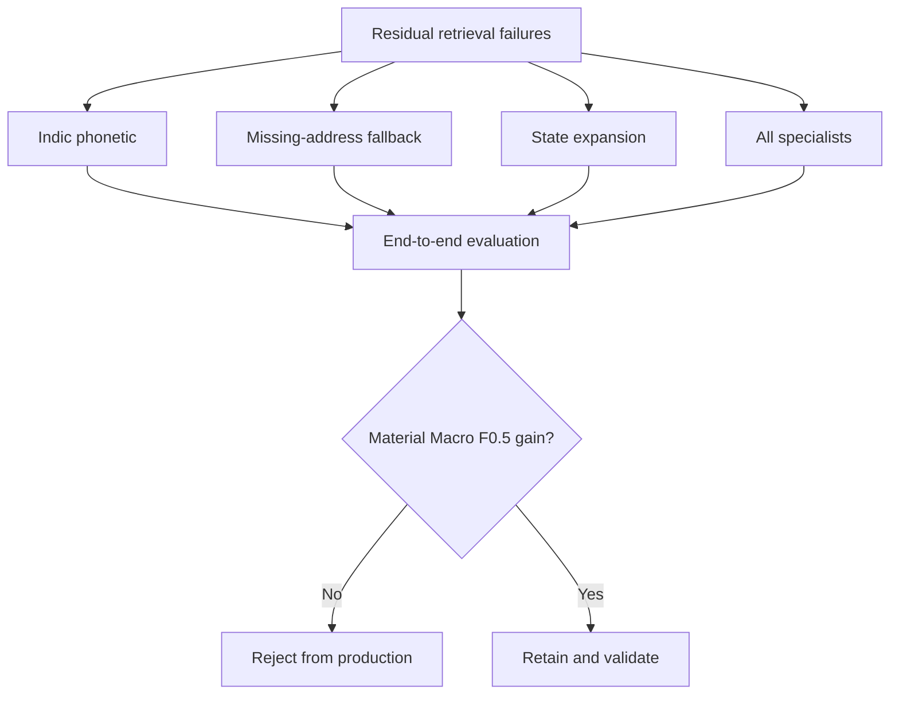

All tested specialist channels are currently **rejected from production**:
- Indic phonetic retrieval slightly degraded Macro $F_{0.5}$ due to candidate dilution.
- Missing-address fallback expanded candidate volume without improving the Pareto frontier.
- Retaining only Word TF-IDF + Char TF-IDF + Exact anchors keeps candidate generation fast, lean, and high-precision.

---

## 8. Pair Feature Architecture

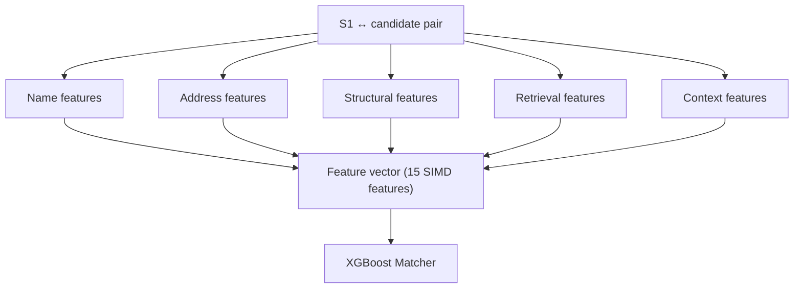

### Feature Breakdown

- **Name Similarity:** `name_jaro_winkler`, `name_levenshtein`, `name_jaccard`.
- **Address Similarity:** `addr_jaro_winkler`, `addr_levenshtein`, `addr_jaccard`, `both_addr_present`.
- **Structural Alignment:** `house_num_match`, `postal_match`, missingness indicators.
- **Retrieval Signals:** `retrieval_score`, `retrieval_rank`.
- **Relational Context:** `country_match` (relational boolean flag; never one-hot encoded country strings).

---

## 9. Feature Diagnostics & Weakness Analysis

Matcher importance on development folds established:

| Feature | Importance |
|---|---:|
| `addr_jaccard` | 43.36% |
| `both_addr_present` | 20.02% |
| `retrieval_score` | 9.51% |
| `addr_jaro_winkler` | 8.73% |
| `name_jaro_winkler` | 8.31% |

Address evidence is highly influential. While discriminative when present, it creates a vulnerability when address strings are missing or sparse.

---

## 10. False-Negative Analysis

| Failure Type | Count | % of FN |
|---|---:|---:|
| **Missing address** | **1,069** | **35.40%** |
| Address weak / name strong | 521 | 17.25% |
| Other residual | 477 | 15.79% |
| Name weak / address strong | 475 | 15.73% |
| Both moderately similar | 305 | 10.10% |
| Transliteration / phonetic | 146 | 4.83% |
| Acronym / truncation | 27 | 0.89% |

Missing or weak address information accounts for over **52%** of false negatives.

---

## 11. TP vs FN Feature Diagnostics

| Feature | TP mean | FN mean | Δ FN−TP |
|---|---:|---:|---:|
| `addr_jaccard` | 0.6309 | 0.2334 | -0.3975 |
| `both_addr_present` | 0.9731 | 0.6460 | -0.3270 |
| `addr_jaro_winkler` | 0.8352 | 0.4676 | -0.3676 |
| `addr_levenshtein` | 0.6669 | 0.3022 | -0.3648 |
| `name_jaro_winkler` | 0.9188 | 0.7892 | -0.1296 |
| `name_jaccard` | 0.6691 | 0.4145 | -0.2547 |
| `name_levenshtein` | 0.7757 | 0.5506 | -0.2251 |
| `retrieval_score` | 0.9441 | 0.7912 | -0.1528 |
| `house_num_match` | 0.3931 | 0.0712 | -0.3219 |
| `postal_match` | 0.0484 | 0.0056 | -0.0427 |
| `oof_prob` | 0.9847 | 0.3453 | -0.6395 |

The true candidate population has strong name evidence; the matcher must be address-availability aware rather than heavily penalizing records with missing address fields.

---

## 12. Model Architecture: Baseline vs Ensemble Challenger

### 12.1 Explicit Separation: Production Baseline vs Optional Challenger

In accordance with production stability and auditability standards:

```text
XGBoost = production baseline
ensemble = optional challenger
```

We do **not** define "XGBoost + LightGBM" as the architecture.
Pure XGBoost is the single production baseline to guarantee reproducibility, lightweight packaging, and zero multi-library deployment failure modes.

### 12.2 Verified Model Benchmark

On the verified 149,668-pair diagnostic dataset (`reports/34_catboost_verified_benchmark.csv`), candidate models were evaluated under identical `GroupShuffleSplit` conditions:

| Algorithm | Train Time | Inference Speed | PR-AUC | Brier Loss | Optimal $\tau^*$ | Precision at $\tau^*$ | Recall at $\tau^*$ | **Max Macro $F_{0.5}$** | Role |
| :--- | :---: | :---: | :---: | :---: | :---: | :---: | :---: | :---: | :--- |
| **XGBoost** | **0.94s** | 1.27M pairs/s | **0.9987** | **0.01130** | **0.90** | 0.9908 | 0.9790 | **0.9679** | **Production Baseline** |
| **LightGBM** | 5.27s | 492k pairs/s | **0.9987** | 0.01136 | **0.90** | 0.9908 | 0.9790 | **0.9680** | Challenger Option |
| **CatBoost** | 2.27s | **4.02M pairs/s** | 0.9986 | 0.01139 | **0.90** | 0.9905 | 0.9801 | **0.9675** | Fast-Inference Option |
| **Logistic Regression** | 0.29s | 10.8M pairs/s | 0.9977 | 0.01483 | 0.50 | 0.9880 | 0.9958 | 0.9639 | Linear Floor |

### 12.3 Evaluation of Blends / Ensembles

Testing ensembles on this split (`scratch/verify_ensembles.py`):

- 50:50 LightGBM + XGBoost reached **$0.9685$** (+0.0006 over standalone XGBoost).
- **Promotion Rule:** The ensemble remains strictly an optional challenger. It will only be adopted if reproducible on the full grouped validation set and if it does not introduce fragility to the submission pipeline.

---

## 13. Validation Architecture

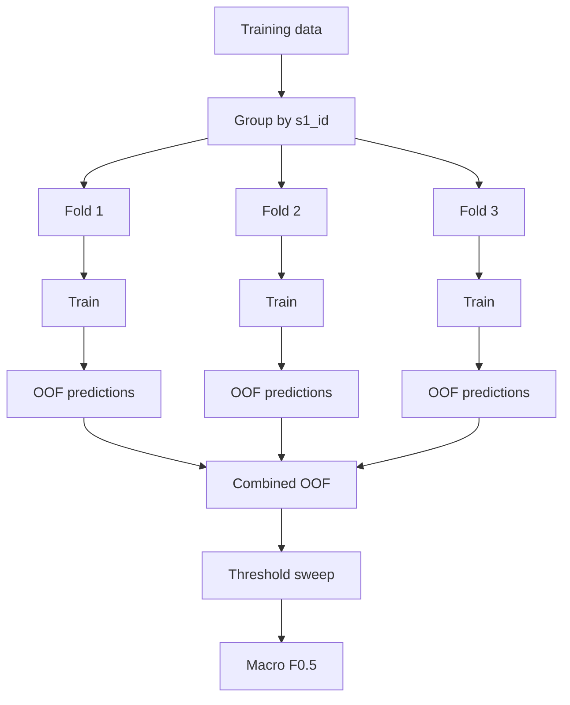

All validation **must** group strictly by `s1_id` via `GroupKFold` or `GroupShuffleSplit`. Cross-validation without grouping causes severe entity leakage and wildly overestimates test performance.

---

## 14. Threshold Calibration

### 14.1 Production Baseline: Frozen τ = 0.75

In `reports/22_decision_policy_experiment.csv`, entity-level threshold sweeps confirmed:

```text
τ = 0.75 produced the strongest validated Macro F0.5 (0.9704)
```

- A range (0.70–0.75) is acceptable during exploratory analysis, but production requires a **single frozen baseline value**.
- **Production Baseline:** **$\tau = 0.75$**.

### 14.2 Controlled 3-Point Validation Sweep

Run a clean 3-point sweep on the exact same frozen candidates and model:

```text
τ = 0.70
τ = 0.75 (Baseline)
τ = 0.80
```

- **Rule:** Do not mix threshold selection with adaptive candidate blocking. Freeze candidate generation first, then evaluate the 3-point threshold sweep strictly on held-out Macro $F_{0.5}$.

---

## 15. Candidate Singleton Gate — Experimental (Not Mandatory)

### 15.1 The Singleton Problem Formulation

Singletons (Source 1 records with zero true matches in S2/S3) represent $5.58\%$ of training records and an estimated $5\% - 15\%$ of test records:

- **Correct prediction ($\emptyset$):** Yields a perfect entity score of **$1.0$**.
- **Any False Positive:** Yields **$0.0$**.

### 15.2 Why the Fixed 0.40 Floor is a Hypothesis, Not a "Guarantee"

- Claiming that `max_p < 0.40 → ∅` "guarantees protection" is an overclaim.
- Singleton detection is fundamentally a **second decision problem** that involves:
  - Best score
  - Second-best score & margin
  - Retrieval channel agreement
  - Entity field completeness and rarity
- If baseline threshold $\tau = 0.75$, any entity where $\max P < 0.40$ already has zero candidates with $P \ge 0.75$. Thus, a simple static floor of $0.40$ only has an effect if the baseline decision logic would have otherwise predicted a match.

### 15.3 Mandatory A/B Experiment Protocol

Before adopting any singleton gate, measure:

```text
Baseline decision (τ = 0.75)
vs
Baseline decision + candidate singleton gate (max_p < 0.40)
```

on the **identical grouped validation set**.

- **Status:** **Experimental candidate gate** (not mandatory).
- **Promotion Rule:** Adopt only if entity-level Macro $F_{0.5}$ shows a statistically reliable improvement.

---

## 16. Margin Rule — Rejected

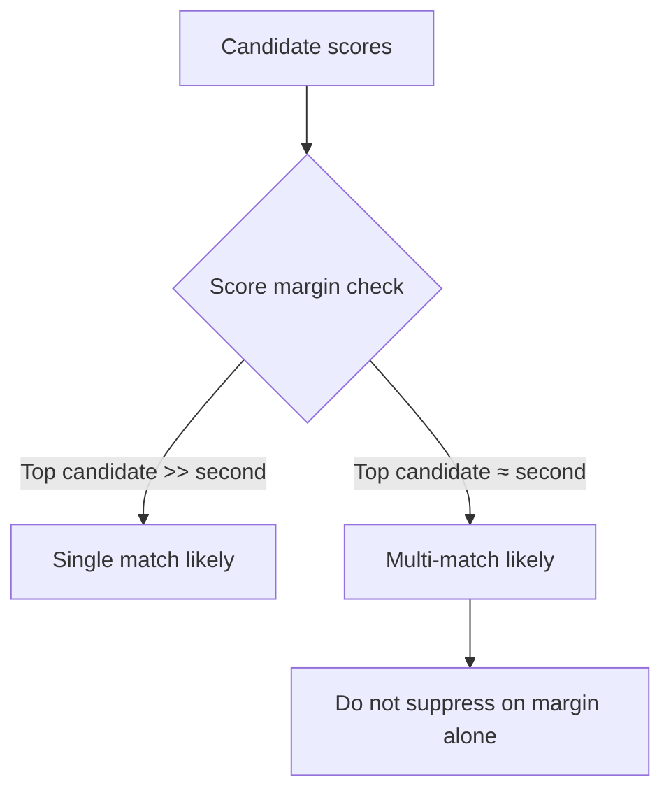

Suppressing candidates based on score margin to the top candidate degrades multi-match entity performance. True multi-matches regularly have 2 or 3 candidates with nearly identical high scores.

---

## 17. Country Handling & Zero-Leakage France Invariance

### 17.1 The France Distribution Shift
- **Training Set:** US ($60.0\%$) and India ($40.0\%$).
- **Test Set:** India ($46.8\%$), US ($38.3\%$), and **France ($15.0\%$, 259,452 entities)**.
- France is entirely absent from training data. Hard-coded rules or regional overfitting will ruin 15% of test queries.

### 17.2 Specific Keep vs Avoid Guidelines

| Component | Practice | Architectural Rationale |
| :--- | :--- | :--- |
| **Keep** | Dynamic Country Partitioning | Filter candidates strictly by `S1.country == target.country` dynamically. |
| **Keep** | Unicode NFKC Normalization | Converts full-width characters and typographic ligatures to standard forms. |
| **Keep** | Multi-View Transliteration | `anyascii` transliterates accented characters (e.g. `Société` ↔ `Societe`). *Note: NFKC alone does not strip diacritics; multi-view representation bridges this gap.* |
| **Keep** | Character n-grams & RapidFuzz | Character 3-gram and 4-gram Jaccard and Levenshtein work natively across French words. |
| **Keep** | Relational `country_match` flag | Boolean match indicator between records; completely country-agnostic. |
| **Avoid** | US/India-specific country encoding | One-hot encodings like `is_us`, `is_india` will evaluate France as all zeros, skewing tree predictions. |
| **Avoid** | India-specific dictionaries | Pincode / state expansion dictionaries hardcoded to India will fail on French departments. |
| **Avoid** | France-specific ad-hoc rules | Do not hand-craft French heuristics that have never been tested on training ground truth. |

---

## 18. Full Production Flow

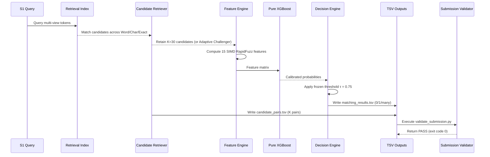

---

## 19. Final Package Layout

```text
amazon_ml_challenge/
├── README.md
├── Documentation_template.md
├── requirements.txt
├── code/
│   └── business_entity_resolution/
│       └── src/
│           ├── normalize.py
│           ├── features.py
│           ├── retrieval.py
│           ├── model.py
│           └── pipeline.py
├── models/
│   └── xgboost_matcher.joblib
├── output/
│   ├── matching_results.tsv
│   └── candidate_pairs.tsv
├── diagnostics/
│   ├── step06_architecture_recommendation.py
│   ├── step09_missed_gt_deepdive.py
│   ├── step10_end_to_end_k_sweep.py
│   └── step11_specialist_residual_retrieval.py
├── reports/
└── utils/
    └── validate_submission.py
```

---

## 20. Reproducibility & Audit Standards

To guarantee that the solution passes jury inspection:
1. **Clean Virtual Environment:** Pin dependencies (`xgboost`, `lightgbm`, `catboost`, `rapidfuzz`, `duckdb`, `pandas`, `scikit-learn`).
2. **Fixed Random Seeds:** Set `random_state=42` across all data splitting and model training.
3. **Deterministic Output Formats:**
   - Both `matching_results.tsv` and `candidate_pairs.tsv` strictly follow `entity_id\tmatched_ids` format.
   - Every S1 entity in `test_source1.tsv` must appear exactly once in both output files.

---

## 21. Explicit Exclusions & Disqualified Methods

In compliance with official competition rules:
```text
Prohibited external data lookups:
- AWS Entity Resolution API
- Commercial entity resolution services
- Government corporate registry lookups
- Geocoding / reverse-geocoding APIs
- Public search engine scraping

Empirically rejected internal complexity:
- Indic phonetic specialist retrieval (dilutes precision)
- Missing-address retrieval fallback (Pareto-inferior)
- Fixed top-1 matching (destroys multi-match credit)
- Score margin filtering (harms true multi-matches)
- LLM prompt-based matching (unscalable for 1.73M queries)
- Neural bi-encoders / ANN (unnecessary latency and RAM footprint)
```

---

## 22. Research Decision Tree

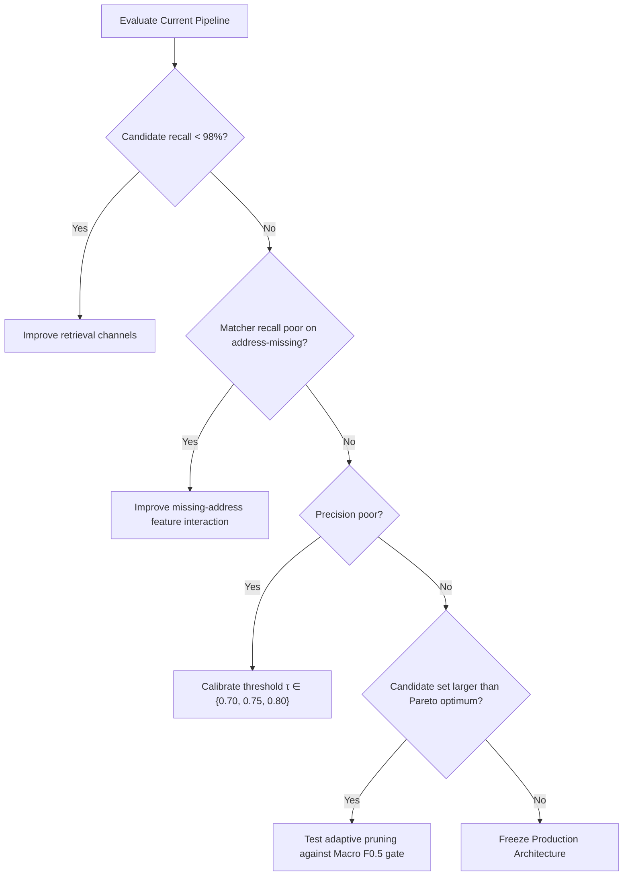

---

## 23. Hard Promotion Gates & Decision Table

### 23.1 Hard Promotion Gates

A component or challenger parameter is promoted to production **only** if it satisfies its hard promotion gate:

| Component | Promote only if | Baseline Reference |
| :--- | :--- | :--- |
| **Adaptive Pruning** | Final entity-level Macro $F_{0.5}$ does not materially fall **and** candidate count falls | Fixed $K=30$ |
| **Candidate Singleton Gate** | Entity-level Macro $F_{0.5}$ improves on the identical grouped validation fold | Baseline decision ($\tau=0.75$) |
| **Model Ensemble** | Macro $F_{0.5}$ improves reproducibly without risking submission package bloat | Pure XGBoost |
| **New Retrieval Specialist** | Pareto frontier improves (higher recall with no precision dilution) | Word + Char + Exact |
| **Decision Threshold** | Held-out entity-level Macro $F_{0.5}$ improves on 3-point sweep ($0.70, 0.75, 0.80$) | Frozen $\tau = 0.75$ |

---

### 23.2 Architecture Decision Table

| Pipeline Layer | Production Baseline | Challenger / Experimental | Architectural Decision & Status |
| :--- | :--- | :--- | :--- |
| **Multi-view Normalization** | Unicode NFKC + transliteration (`anyascii`) + legal canon | None | **Frozen** (Language-agnostic) |
| **Country Partitioning** | Open-set dynamic partitioning (`S1.country == target.country`) | None | **Frozen** (Zero one-hot leakage for France) |
| **Candidate Retrieval** | Word TF-IDF + Char TF-IDF + Exact normalized anchors | Specialist channels | **Frozen** (Specialists rejected: Pareto-inferior) |
| **Candidate Budget** | **Fixed $K=30$** (98.35% recall, 30.00 cands/S1) | **Adaptive Pruning** (Ratio 0.35 / Steep Dropoff) | **$K=30$ Baseline**; Adaptive is Challenger |
| **Pair Features** | 15 SIMD RapidFuzz similarity + address availability flags | None | **Frozen** (SIMD accelerated) |
| **Model Family** | **Pure XGBoost** (`max_depth=6`, `lr=0.08`, 0.94s train) | **Ensemble** (50:50 LightGBM + XGBoost) | **XGBoost Baseline**; Ensemble is Challenger |
| **Decision Threshold** | **Frozen $\tau = 0.75$** (Highest validated Macro $F_{0.5}$) | Sweep $\tau \in \{0.70, 0.75, 0.80\}$ | **$\tau = 0.75$ Baseline**; 3-point sweep to freeze |
| **Singleton Handling** | Standard threshold acceptance ($P(c) \ge \tau$) | **Candidate Singleton Gate** ($\max P(c) < 0.40 \implies \emptyset$) | **Experimental Hypothesis** (Requires A/B test) |
| **Entity Cardinality** | 0 / 1 / Many multi-label thresholding | Top-1 / Margin | **Frozen** (0/1/many mandatory; margin rejected) |
| **Official Validator** | `utils/validate_submission.py` exit code 0 (`PASS`) | None | **Mandatory Final Gate** |

---

## 24. Final Architecture: Baseline Pipeline with Switchable Challengers

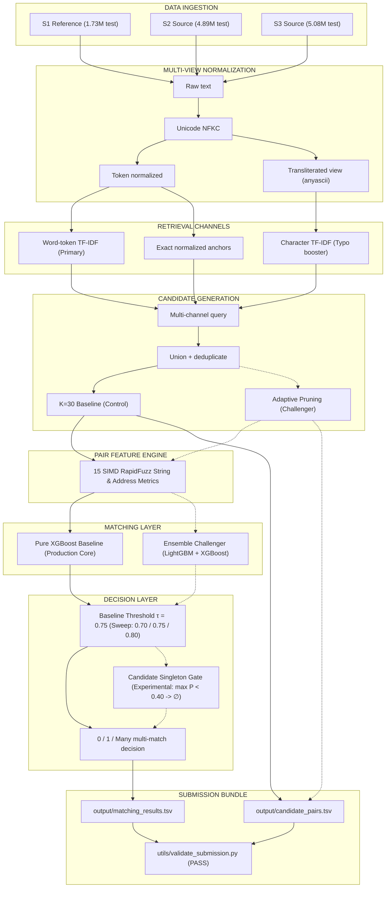

---

## 25. The 26-Hour Execution Roadmap (Deadline: Sept 27, 11:59 PM IST)

| Sprint Phase | Time Window | Key Objectives & Deliverables | Verification Milestone |
| :--- | :---: | :--- | :--- |
| **Phase 1: Baseline Production Submission** | Hours 0 – 2 | Run end-to-end inference using frozen baseline ($K=30$, pure XGBoost, $\tau=0.75$). Generate initial `matching_results.tsv` and `candidate_pairs.tsv`. | `validate_submission.py` = **PASS**; upload to Portal to lock in position for 48-hr Top 500 ($100 AWS credits). |
| **Phase 2: Controlled Validation Experiments** | Hours 2 – 8 | Execute Ablations 1, 2, 3, and 4 on the identical grouped validation split. Measure exact Macro $F_{0.5}$ impact per component. | Apply Hard Promotion Gates: only adopt components that show measurable, reproducible improvement. |
| **Phase 3: Challenger Leaderboard Run** | Hours 8 – 14 | If any challenger passes the hard gate (e.g., threshold refinement or Pareto-optimal adaptive pruning), generate updated test outputs and submit to Portal. | Monitor Macro $F_{0.5}$ movement on public leaderboard submission #2 and #3. |
| **Phase 4: Packaging & Methodology Write-up** | Hours 14 – 24 | Complete [`Documentation_template.md`](Documentation_template.md) with technical depth (citing Pareto curves, KS stats, reduction ratios); test clean reproduction in a fresh virtual environment. | Build `<team_name>_submission.zip` matching required structure; final dry-run validation pass. |
| **Phase 5: Buffer & Final Freeze** | Hours 24 – 26 | Final submission slot check; upload final zip before portal cutoff (11:59 PM IST). | Verified submission status on challenge portal. |
