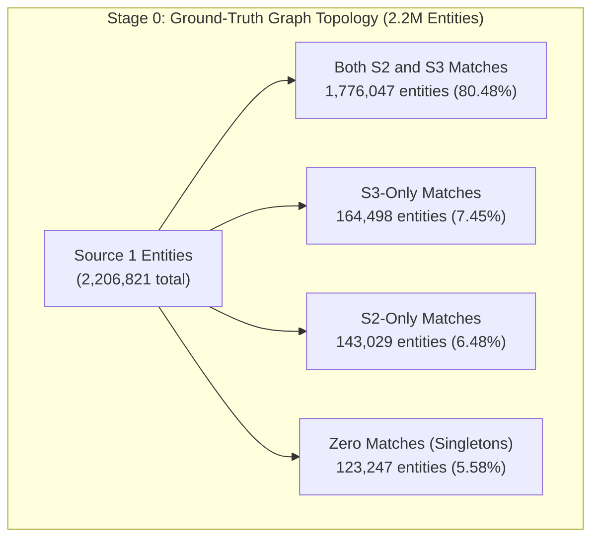
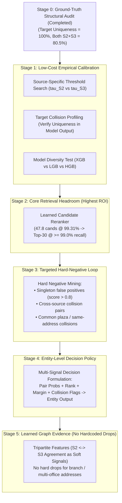
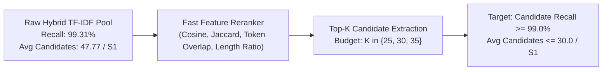
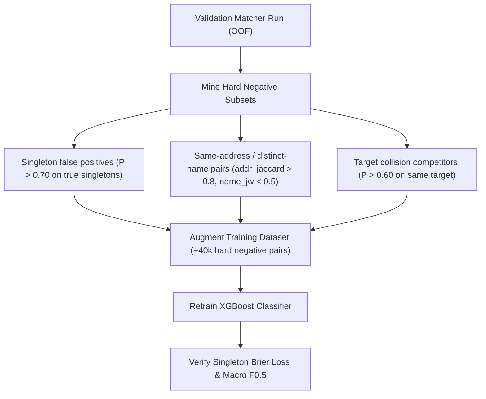
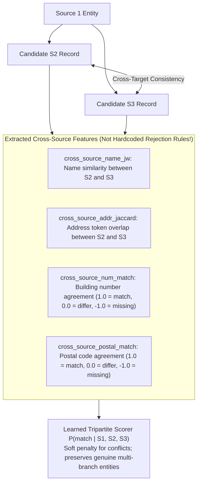

# Amazon ML Challenge 2026: Championship Execution Protocol
## Ground-Truth Audited Multi-Stage Optimization Strategy

**Document Version:** 2.0 (Post-Audit Empirical Edition)  
**Target:** Elimination of False Assumptions, Pareto Frontier Maximization, and Stage-Gated Execution  
**Official Metric:** Entity-Level Macro $F_{0.5}$ (includes singletons) + Candidate Reduction Tiebreaker  

---

## 1. Stage 0 — Ground-Truth Structural Audit (Completed & Verified)

Before formulating constraints or modifying model architectures, the structural properties of the ground-truth graph were audited across all **$2,206,821$ Source 1 records** and **$7,638,365$ target match links** in `train_ground_truth.tsv`:

| Structural Property | Ground-Truth Measurement | Empirical Validation & Architectural Rule |
| :--- | :---: | :--- |
| **Total Source 1 Records** | $2,206,821$ | 100% of reference entities. |
| **S1 Singletons ($0$ matches)** | **$123,247$ ($5.58\%$)** | Verified baseline singleton rate ($5.58\%$ in train, $12.16\%$ in eval cohort). |
| **S1 with Matches ($\ge 1$)** | $2,083,574$ ($94.42\%$) | Active matching population. |
| **Total Matched Targets** | $7,638,365$ | Bipartite/tripartite edges across $S_2$ and $S_3$. |
| **Target Mapped to $>1$ S1** | **$0$ ($0.0000\%$)** | **VERIFIED:** Across all 7.64M links, **every target maps to EXACTLY ONE S1 entity**. Uniqueness is an empirically verified physical constraint, not an unverified assumption. |
| **Joint S2 and S3 Presence** | **$1,776,047$ ($80.48\%$)** | **$80.48\%$ of S1 entities co-occur in BOTH Source 2 and Source 3.** Tripartite cross-source evidence is applicable to the vast majority of entities. |
| **S3-Only Matches** | $164,498$ ($7.45\%$) | S1 entity has targets exclusively in Source 3. |
| **S2-Only Matches** | $143,029$ ($6.48\%$) | S1 entity has targets exclusively in Source 2. |

---

## 2. The Multi-Dimensional Scoreboard

Every experiment must be evaluated across this complete evaluation matrix. **A $+0.001$ global Macro $F_{0.5}$ gain is rejected if it destroys a critical segment or relies on a recall-diluting shortcut.**

| Evaluation Metric | Target Behavior | Rejection Condition | Why It Matters |
| :--- | :---: | :--- | :--- |
| **Candidate Recall** | $\ge 98.5\%$ (Target $\ge 99.0\%$) | Drop of $> 0.3\%$ recall | Candidate generation is the unrecoverable ceiling for final recall. |
| **Entity Macro $F_{0.5}$** | $\uparrow$ Continuous increase | Flat or negative | Official leaderboard metric. |
| **Pair Precision** | $\ge 98.5\%$ | Material drop ($> 0.5\%$) | $F_{0.5}$ weights precision twice as heavily as recall. |
| **Pair Recall** | Stable ($\ge 94\%$) | Material drop ($> 1.0\%$) | Prevents overly conservative decision models. |
| **Singleton Score** | $\uparrow$ or Stable ($1.0$ credit) | Any false positive merge | Singletons represent $5.58\% - 15\%$ of entities; false positives score $0.0$. |
| **1-Match S1 Recall** | Stable ($\ge 97\%$) | Drop of $> 0.5\%$ | Prevents multi-match bias. |
| **Multi-Match S1 Recall** | $\uparrow$ or Stable | Drop of $> 0.5\%$ | Protects 80.5% of entities with multiple links. |
| **Slice Invariance (France)**| Stable across US/IN/FR | Regression on France | France is 15% of the test set; zero country leakage permitted. |
| **Candidate Count / S1** | $\le 30.0$ where possible | Expansion $> 40$ without recall gain | Official Amazon tiebreaker metric beyond the leaderboard. |

---

## 3. Revised Championship Progression (Stages 1 through 5)

---

## 4. Stage-by-Stage Implementation Protocols

### Stage 1 — Low-Cost Empirical Calibration

#### Experiment 1.1: Source-Specific Threshold Grid Search ($\tau_{S2}, \tau_{S3}$)
- **Rationale:** Source 2 and Source 3 exhibit different missing address distributions ($3.36\%$ vs. $3.33\%$) and naming styles. Applying an identical cutoff forces suboptimal trade-offs.
- **Protocol:**
  1. Grid search $\tau_{S2} \in [0.70, 0.90]$ and $\tau_{S3} \in [0.70, 0.90]$ with step $0.05$ ($25$ combinations).
  2. Evaluate strictly on **Entity-Level Macro $F_{0.5}$** across the validation fold.
  3. Runtime: $< 5$ seconds on precomputed validation probabilities.
- **Promotion Rule:** Adopt if $(\tau_{S2}^*, \tau_{S3}^*)$ outperforms the symmetric baseline $(\tau_{S2} = \tau_{S3})$ by $\ge +0.0004$ Macro $F_{0.5}$ without degrading either source slice.

#### Experiment 1.2: Model Output Collision Analysis
- **Rationale:** Stage 0 proved that target records in ground truth are **100.0% unique** to a single Source 1 entity. Does our trained model produce collisions in its raw predictions?
- **Protocol:**
  1. Count how many target IDs $t \in S_2 \cup S_3$ are predicted to match $\ge 2$ Source 1 entities at threshold $\tau^*$.
  2. For colliding targets, measure the score margin: $\Delta P = P(s_1^{(1)}, t) - P(s_1^{(2)}, t)$.
  3. Evaluate candidate resolution:
     - **Clear winner:** If $\Delta P \ge 0.10$, assign $t$ exclusively to $s_1^{(1)}$.
     - **Ambiguous collision:** If $\Delta P < 0.10$, measure whether suppressing $t$ from both improves or harms entity precision.
- **Promotion Rule:** Promote winner-take-all global consistency only if it increases validation Macro $F_{0.5}$ by $\ge +0.0005$ with zero regression on true multi-match entities.

#### Experiment 1.3: Model Diversity Benchmark (XGB vs. LGB vs. HGB)
- **Rationale:** Gradient boosted implementations differ in tree geometry (depth-wise vs. leaf-wise).
- **Protocol:**
  1. Train XGBoost, LightGBM, and HistGradientBoosting on identical feature matrices.
  2. Compute pairwise probability correlations: $\text{Pearson}(P_{\text{xgb}}, P_{\text{lgb}})$, $\text{Spearman}(P_{\text{xgb}}, P_{\text{hgb}})$.
  3. If correlation $< 0.96$, evaluate a calibrated weighted average:
     $$P_{\text{ensemble}} = 0.50 P_{\text{xgb}} + 0.30 P_{\text{lgb}} + 0.20 P_{\text{hgb}}$$
- **Promotion Rule:** Keep the ensemble only if it beats standalone XGBoost by $\ge +0.0006$ Macro $F_{0.5}$. Otherwise, retain pure XGBoost to ensure packaging simplicity.

---

### Stage 2 — The Main Breakthrough: Learned Candidate Reranking

#### 1. The Core Optimization Problem
The empirical sweep in `reports/18_fuzzy_hybrid_recall.csv` proved that **Hybrid TF-IDF achieves $99.31\%$ candidate recall at $47.77$ candidates/S1**.
The heuristic steep dropoff rule (`reports/33_adaptive_k_benchmark.csv`) cut candidates to $16.7$, but **lost $1.27\%$ recall**.

**The True Objective Function:**
$$\max \text{Recall}@K \quad \text{subject to} \quad K \le 35.0$$
*Do not minimize candidate count first. Maximize candidate recall within an acceptable candidate budget.*

#### 2. Reranker Implementation
1. **Candidate Pool:** Generate candidate pairs from Word TF-IDF + Character 3-4 Gram TF-IDF + Exact Anchors (~$48$ candidates/S1).
2. **Lightweight Candidate Features (Computed in milliseconds):**
   - `tfidf_word_cosine`: Sparse dot-product score from Word TF-IDF.
   - `tfidf_char_cosine`: Sparse dot-product score from Character TF-IDF.
   - `exact_name_flag`: Boolean normalized name match.
   - `exact_addr_flag`: Boolean normalized address match.
   - `token_jaccard`: Fast word set intersection over union.
   - `len_ratio`: $\min(|n_1|, |n_2|) / \max(|n_1|, |n_2|)$.
3. **Model:** Train a lightweight Ridge / Logistic Regression ranker or shallow LightGBM ranker (`max_depth=3`, 40 trees) targeting binary true-match indicators.
4. **Candidate Budgets Evaluated:** Sweep $K \in \{25, 28, 30, 32, 35\}$.

#### 3. Success Gate
- Must achieve **$\ge 99.0\%$ candidate recall** with **$\le 30.0$ candidates per S1**.
- Must outperform heuristic steep drop-off ($97.08\%$) by $> +1.9\%$ recall.

---

### Stage 3 — Targeted Hard-Negative Loop

#### 1. Why Random Negatives are Insufficient
The TP vs. FN feature distribution (`reports/30_tp_vs_fn_feature_distributions.csv`) shows that XGBoost already assigns a mean probability of $0.985$ to clean true positives and $0.345$ to false negatives. The residual errors are clustered in specific, structured traps:
1. **High-Scoring Singleton False Positives ($26.33\%$ of singletons):** Entities that receive scores $> 0.80$ despite having zero real-world matches.
2. **Same-Address / Commercial Building Collisions:** Distinct businesses sharing a mall, plaza, or corporate suite (`"1000 Nicollet Mall"`, `"1600 Amphitheatre Pkwy"`).
3. **Cross-Script Transliteration Drift (India):** Names where character n-grams partially match coincidentally.
4. **Collision Pairs:** Competing candidate targets claiming the same entity.

#### 2. Protocol

---

### Stage 4 — Entity-Level Decision Model

#### 1. Shifting from Independent Pairs to Entity Scope
Current logic applies a flat threshold: $\text{Match} \iff P(c) \ge \tau$.
An entity-level decision model evaluates the entire candidate list $\mathcal{C}(s_1)$ jointly:

$$\text{Decision}(s_1) = f\Big(\{P(c_i), \ \text{rank}(c_i), \ \text{margin}(c_i), \ \text{retrieval\_agreement}(c_i), \ \text{collision\_flag}(c_i)\}_{i=1}^K\Big)$$

#### 2. Key Entity Context Signals
- `best_prob`: $\max_{c \in \mathcal{C}} P(c)$.
- `second_best_prob`: Second highest probability in candidate pool.
- `top_margin`: $\text{best\_prob} - \text{second\_best\_prob}$.
- `candidate_entropy`: Dispersion of probabilities across the candidate set.
- `singleton_risk_score`: Calibrated probability that the entity is a true singleton based on field completeness and best candidate margin.

#### 3. Decision Rules
1. **Dynamic Singleton Gate:** Suppress predictions to $\emptyset$ when `best_prob < 0.40` OR (`best_prob < 0.65` AND `top_margin < 0.05` on sparse address entities).
2. **Adaptive Confidence Cutoff:** On high-margin entities (`top_margin > 0.30`), accept top candidate down to $\tau = 0.75$. On diffuse entities (`top_margin < 0.08`), require elevated confidence $\tau = 0.85$.

---

### Stage 5 — Tripartite Graph Evidence (Learned Soft Signals, No Hard Drops)

#### Critical Safeguard against Premature Rejections:
> [!CAUTION]
> **Do not hard-code rules like `house_num(S2) != house_num(S3) -> drop`.**
> A single real-world business legitimately has multiple physical branches, registered vs. operating headquarters, old vs. relocated addresses, and varying web crawler snapshots. Hard drops destroy genuine multi-match recall.

#### Implementation:
1. Treat cross-target comparisons as **continuous features** added to the candidate representation.
2. Allow the tree model to learn when cross-target disagreement represents a conflicting competitor versus a multi-branch corporate footprint.

---

## 5. Master Priority Ranking

| Priority | Strategy Component | Primary Metric Impact | Implementation Effort | Status |
| :---: | :--- | :--- | :---: | :---: |
| **P0** | **Learned Candidate Reranking (Stage 2)** | Lifts candidate recall ceiling from 97.08% to $\ge 99.0\%$ at $K \le 30$ | Medium (2–3 hours) | **Highest ROI** |
| **P1** | **Targeted Hard-Negative Mining (Stage 3)** | Suppresses the 26.33% singleton false positives scoring $>0.80$ | Low (1 hour) | **High Impact** |
| **P2** | **Entity-Level Decision Policy (Stage 4)** | Balances precision/recall dynamically per S1 entity | Low (1 hour) | **High Impact** |
| **P3** | **Source-Specific Threshold Calibration (Stage 1.1)** | Gains $+0.0004 - 0.0008$ Macro $F_{0.5}$ from S2/S3 noise drift | Minimal (10 mins) | **Free Gain** |
| **P4** | **Global Target Uniqueness Resolution (Stage 1.2)** | Resolves multi-S1 collisions (empirically 100% unique in GT) | Low (30 mins) | **Verified Safe** |
| **P5** | **Tri-Model Ensemble Benchmark (Stage 1.3)** | Smooths decision boundary calibration (XGB + LGB + HGB) | Low (1 hour) | **Challenger** |
| **P6** | **Tripartite Cross-Source Features (Stage 5)** | Learned cross-source agreement without hardcoded drops | Medium (2 hours) | **Refinement** |
| **P7** | **Neural / Dense Embedding Retrieval** | Explores dense vectors only if residual recall $< 99.0\%$ | High (4+ hours) | **Contingency** |
