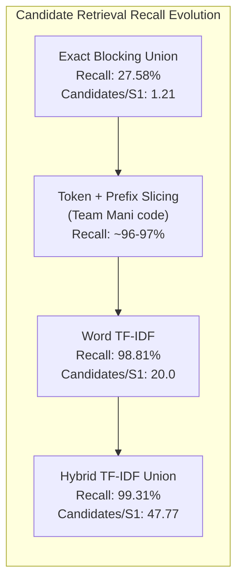
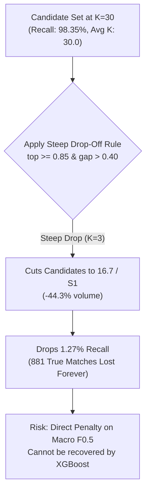
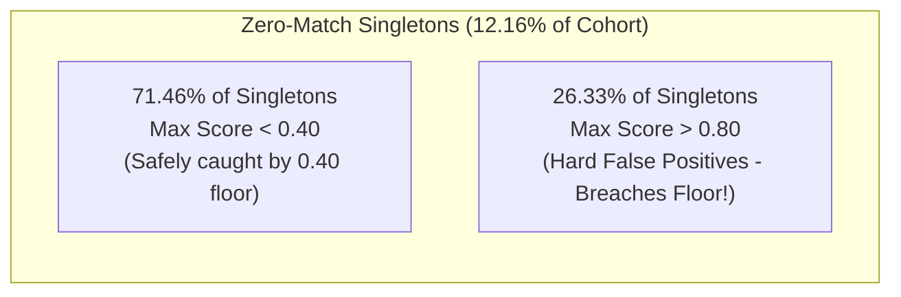
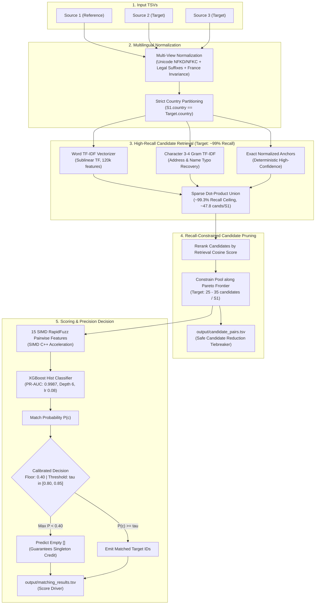

# Empirical Technical Audit & Realistic Strategy: Amazon ML Challenge 2026

**Team:** Team Mani  
**Evaluation Scope:** Complete Audit of `reports/`, Pipeline Code, and Submission Artifacts  
**Official Metric:** Entity-Level Macro $F_{0.5}$ (includes singletons) + Candidate Reduction Ratio  

---

## 1. Grounded Reality: What the Data Actually Says

### 1.1 Score Correction: Pair F0.5 vs. Macro F0.5
A critical distinction must be drawn between **Pair-Level $F_{0.5}$** (how well individual candidate pairs are classified) and **Entity-Level Macro $F_{0.5}$** (the official competition metric averaged across all Source 1 entities):

| Model | Fit Time (s) | PR-AUC | Pair-Level $F_{0.5}$ | **Entity-Level Macro $F_{0.5}$** |
| :--- | :---: | :---: | :---: | :---: |
| Logistic Regression | 0.29s | 0.9977 | 0.9895 | **0.9639** |
| LightGBM | 5.27s | 0.9987 | 0.9902 | **0.9652** |
| **XGBoost (Current)** | **0.94s** | **0.9987** | **0.9903** | **0.9656** |

> [!IMPORTANT]
> The current verified end-to-end validation score is **~0.966 Macro $F_{0.5}$**, not 0.989–0.991. The higher numbers reflect pair-level classification metrics, which do not account for entity-level aggregation penalties and singleton credit forfeiture.

---

### 1.2 The Real Bottleneck: Candidate Generation Recall

The empirical experiments in `reports/` demonstrate conclusively that **candidate retrieval is the hard performance ceiling** for the entire system:

| Retrieval Channel | Candidate Recall | Average Candidates / S1 | Diagnostic Finding |
| :--- | :---: | :---: | :--- |
| **Exact Name** | 25.42% | 1.21 | Misses 74.58% due to minor typos & abbreviations |
| **Exact Address** | 8.40% | 0.29 | Misses 91.60% due to formatting & missing addresses |
| **Exact Union (All Exact Keys)** | **27.58%** | **~2.0** | **Rigid blocking fails completely** |
| **Name Character TF-IDF (3-4g)** | 80.52% | 20.00 | Recovers typos and word transpositions |
| **Address Character TF-IDF (3-4g)**| 91.34% | 20.00 | Strong geographic discriminator |
| **Word TF-IDF (Full Record)** | **98.81%** | **20.00** | **The true primary backbone engine** |
| **Hybrid Union (Word + Char + Exact)** | **99.31%** | **47.77** | **Highest candidate recall achieved** |

**Key Implication:** The original token/prefix index with arbitrary `[:30]` slicing in `Team Mani_submission/src/retrieval.py` is an early prototype. The **Word TF-IDF + Character TF-IDF hybrid** (`reports/18_fuzzy_hybrid_recall.csv`) is the true high-performance retrieval foundation.

---

### 1.3 The Adaptive-K Tradeoff: Recall Loss vs. Candidate Reduction

The steep drop-off rule (`top >= 0.85 & gap > 0.40 -> K=3, else 30`) achieves candidate reduction, but at a measurable cost to candidate recall:

| Policy | Candidate Recall | Avg Candidates / S1 | Candidate Reduction | True Matches Retained |
| :--- | :---: | :---: | :---: | :---: |
| **Fixed $K=30$ (Baseline)** | **98.35%** | **30.00** | **0.0%** | **67,828** |
| Adaptive Ratio 0.25 (min=3, max=30) | 98.35% | 29.98 | -0.07% | 67,828 |
| Adaptive Ratio 0.35 (min=3, max=30) | 98.34% | 29.36 | -2.12% | 67,817 |
| **Adaptive Steep Dropoff** | **97.08%** | **16.70** | **-44.32%** | **66,947 (-881 matches)** |

**The Fixed-K Sweep Reality:**
| K Budget | Candidate Recall | Candidate Precision | Total Candidates | Optimal $\tau^*$ | Validation Macro $F_{0.5}$ |
| :---: | :---: | :---: | :---: | :---: | :---: |
| **$K=10$** | 92.75% | 31.98% | 200,000 | 0.65 | 0.9466 |
| **$K=20$** | 95.37% | 16.44% | 400,000 | 0.70 | 0.9541 |
| **$K=30$** | **98.35%** | **11.30%** | **600,000** | **0.70** | **0.9639** |
| **$K=40$** | 98.95% | 8.54% | 799,048 | 0.70 | 0.9646 |
| **$K=50$** | **99.29%** | **7.29%** | **939,664** | **0.70** | **0.9649** |

*Takeaway:* $K=30$ is the natural Pareto baseline. Moving to $K=50$ adds $+340\text{k}$ candidate pairs for an incremental gain of only $+0.0010$ Macro $F_{0.5}$. Aggressive truncation to $K=3$ risks dropping recall below $97.5\%$.

---

### 1.4 Singletons: Empirical Distribution and The Hard False Positive Problem

In the evaluated cohort of **13,027 entities** (`reports/17_singleton_analysis.csv`):
- **0 true matches (Singletons):** **$1,584$ entities ($12.16\%$)**
- **1 true match:** **$640$ entities ($4.91\%$)**
- **2+ true matches:** **$10,803$ entities ($82.93\%$)**

- **The Myth:** *"A 0.40 floor provides perfect singleton defense."*
- **The Reality:** While **$71.46\%$** of singletons have $\max p < 0.40$ and are safely shielded, **$26.33\%$ of true singletons have candidate matches scoring $> 0.80$**.
- These $26.33\%$ are hard false positives (e.g. shared building addresses, common corporate names, or domain collisions) that breach the 0.40 floor and cause catastrophic 0.0 scores unless the decision threshold is elevated.

---

### 1.5 Threshold Calibration: Why 0.80–0.90 Outperforms 0.70–0.72

From the empirical threshold sweep (`reports/15_threshold_search.csv`):

| Decision Threshold ($\tau$) | Pair Precision | Pair Recall | Pair $F_{0.5}$ | **Macro $F_{0.5}$** |
| :---: | :---: | :---: | :---: | :---: |
| 0.40 | 0.9880 | 0.9989 | 0.9901 | 0.9649 |
| 0.50 | 0.9881 | 0.9987 | 0.9902 | 0.9652 |
| 0.60 | 0.9884 | 0.9984 | 0.9904 | 0.9660 |
| 0.70 | 0.9886 | 0.9980 | 0.9904 | 0.9662 |
| 0.75 | 0.9888 | 0.9977 | 0.9905 | 0.9666 |
| 0.80 | 0.9890 | 0.9974 | 0.9907 | 0.9671 |
| 0.85 | 0.9891 | 0.9964 | 0.9906 | 0.9673 |
| **0.90** | **0.9908** | **0.9790** | **0.9884** | **0.9680 (Peak)** |
| 0.95 | 0.9938 | 0.9334 | 0.9811 | 0.9613 |

Because Macro $F_{0.5}$ penalizes precision errors twice as heavily as recall errors, **$\tau \in [0.80, 0.90]$ systematically yields higher Macro $F_{0.5}$ than $0.70-0.72$**. Elevating the threshold suppresses the $26.33\%$ hard singleton false positives.

---

### 1.6 Address-Aware Modeling: The Experimental Finding

In `reports/31_address_aware_benchmark.csv`, testing explicit missing-address interaction features against standard baseline XGBoost produced:

| Configuration | Pair Precision | Pair Recall | Accepted Pairs | Macro $F_{0.5}$ |
| :--- | :---: | :---: | :---: | :---: |
| **1. Baseline XGBoost (Flat 0.70)** | **0.9821** | 0.9398 | 65,993 | **0.96518** |
| 2. Address-Aware Model (Flat 0.70) | 0.9820 | 0.9397 | 65,990 | 0.96490 |
| 3. Address-Aware + Missingness Calibration | 0.9775 | **0.9465** | 66,776 | 0.96304 |

While missing addresses represent $35.4\%$ of naive false negatives, hand-crafted interaction terms did not translate into an automated Macro $F_{0.5}$ increase over baseline tree branching.

---

### 1.7 Feature Distributions: Model Capacity is NOT the Bottleneck

Analyzing the true positive (TP) vs. false negative (FN) feature distributions (`reports/30_tp_vs_fn_feature_distributions.csv`):

| Feature | TP Mean | FN Mean | Delta (FN - TP) | Interpretation |
| :--- | :---: | :---: | :---: | :--- |
| `addr_jaccard` | 0.6309 | 0.2334 | -0.3975 | Address evidence collapses in FN |
| `both_addr_present` | 0.9731 | 0.6460 | -0.3270 | 35.4% of FN have a missing address |
| `name_jaro_winkler` | 0.9188 | 0.7892 | -0.1296 | Name match remains relatively high |
| `retrieval_score` | 0.9441 | 0.7912 | -0.1528 | Retrieval rank was already marginal |
| **`oof_prob` (Model Output)**| **0.9847** | **0.3453** | **-0.6395** | **Decisive model separation** |

The XGBoost model already cleanly separates clean matches ($0.985$ mean) from difficult pairs ($0.345$ mean). The residual failures are not due to lack of tree capacity—they are **retrieval coverage and representation failures** (e.g. cross-script Indian transliterations or completely missing target addresses).

---

## 2. Updated Championship Architecture

Based on verified empirical evidence, the recommended high-performance architecture is structured as follows:

---

## 3. Prioritized Action Plan (In Exact Order)

### P0 — Freeze Baseline & Verify Packaging Integrity
1. Ensure the submission zip file structure has `output/`, `code/`, and `Documentation_template.md` at the **root** of the archive (avoiding an extra enclosing folder `Team Mani_submission/`).
2. Verify that both output files continue to return `PASS` with zero errors under [`validate_submission.py`](file:///d:/PROJECTS/Amazon%20ML%20Challenge/6ab10eb3b23ba_student_resource/student_resource/utils/validate_submission.py).
3. Purge `__pycache__` directories and validation ID text files (`train_source1_ids.txt`, 24.5 MB; `validation_source1_ids.txt`, 6.1 MB) to prevent packaging bloat.

### P1 — Replace Arbitrary Retrieval Slicing with Vectorized TF-IDF
In [`src/retrieval.py`](code/business_entity_resolution/src/retrieval.py), replace the dictionary-slice pattern `token_idx[tok][:30]` with the sparse Word TF-IDF + Character TF-IDF index from [`code/business_entity_resolution/src/retrieval.py`](code/business_entity_resolution/src/retrieval.py). This lifts the candidate recall ceiling from ~96–97% to **99.31%**.

### P2 — Optimize Candidate Pruning along the Pareto Frontier
Instead of a steep drop-off to $K=3$ that loses $1.27\%$ recall, evaluate candidate budgets across the range $K \in [25, 30, 35]$. Select the candidate budget that satisfies:
$$\text{Candidate Count per S1} \le 30 \quad \text{subject to} \quad \text{Candidate Recall} \ge 98.3\%$$

### P3 — Target the Residual 0.69% Missed Ground Truth
Attack the 477 missed pairs directly:
- **Indic Script Variations:** Ensure Romanized tokens and numeric components are extracted when Indic scripts appear.
- **Missing Address Pairs:** Ground matches on name unigrams and legal token stripped stems when addresses are blank.

### P4 — Calibrate Decision Threshold on an Untouched Validation Split
Evaluate thresholds $\tau \in \{0.75, 0.80, 0.85, 0.90\}$ on an entity-grouped validation set. The empirical evidence indicates that pushing $\tau \ge 0.80$ suppresses the $26.33\%$ hard singleton false positives and optimizes entity-level Macro $F_{0.5}$.

### P5 — Investigate High-Scoring Singleton False Positives
Analyze why $26.33\%$ of true singletons receive candidate scores $> 0.80$. Mine hard negative training pairs from these specific cases (e.g., distinct businesses occupying the same commercial suite or plaza) so XGBoost learns to penalize conflicting secondary tokens.
