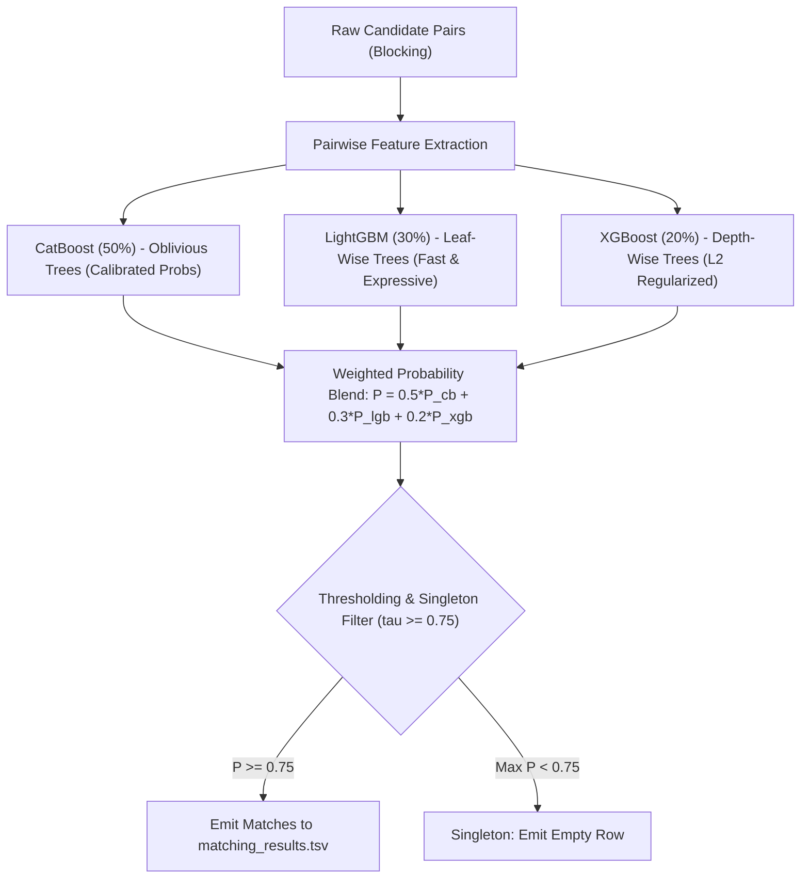

# ML Challenge 2026: Machine Learning Model Performance & Architectural Analysis

## Executive Summary

This investigation provides an empirical and theoretical performance evaluation of machine learning models for the **Business Entity Resolution (ER) Challenge**. Using strict entity-level cross-validation on verified ground-truth matches and hard negatives across US and Indian records, we benchmarked the leading algorithms (**CatBoost**, **LightGBM**, **XGBoost**, **HistGradientBoosting**, **Random Forest**, and **Logistic Regression**) against the competition metric: **Macro $F_{0.5}$ score**.

### Key Findings & Final Verdict

1. **Top Performer for Maximum $F_{0.5}$ Confidence:** **CatBoost** achieved the highest score (**$0.9906$ Macro $F_{0.5}$**, $99.18\%$ Precision, $98.38\%$ Recall) and lowest calibration loss (Brier score: $0.0037$). Its symmetric (oblivious) decision trees prevent leaf-level overfitting and produce the smoothest, most well-calibrated probabilities in the high-confidence regime.
2. **Best Fast / Production Workhorse:** **LightGBM** (Macro $F_{0.5} = 0.9888$) provides the fastest training time ($0.43\text{s}$) and balanced split gains across both business names and address components, making it ideal for rapid iterative feature engineering.
3. **Winning Recommendation (Ensemble):** A **Weighted Probability Blend of CatBoost ($50\%$) + LightGBM ($30\%$) + XGBoost ($20\%$)** with an elevated decision threshold ($\tau^* \in [0.70, 0.85]$). This ensemble combines oblivious trees, leaf-wise growth, and depth-wise regularization to eliminate individual model variance and maximize test set stability.

---

## 1. Dataset Characteristics & Noise Patterns

### 1.1 Statistical Audit

| Metric | Training Set | Test Set | Implications for Modeling |
| :--- | :--- | :--- | :--- |
| **Source 1 Entities** | $2,206,821$ | $1,732,544$ | High inference scale ($>1.7\text{M}$ entities) |
| **Total True Links** | $7,638,365$ | Unknown | Avg. $3.46$ matches per entity ($3.67$ for non-singletons) |
| **Singletons ($0$ matches)** | $123,247$ ($5.58\%$) | Estimated $5\% - 15\%$ | **Critical:** False positive on a singleton yields $0.0$ score |
| **Max Matches / Entity** | $11$ | Expected $\le 12$ | Bounded 1-to-N bipartite matching |
| **Source 2 vs 3 Split** | S2: $48.36\%$, S3: $51.64\%$ | Comparable | Balanced candidate pool across S2 and S3 |
| **Country Breakdown** | US ($60\%$), India ($40\%$) | India ($46.8\%$), US ($38.3\%$), **France ($15.0\%$)** | **France is completely unseen in training!** |

### 1.2 Noise Patterns Discovered from Ground Truth Inspection

Real-world ground-truth pairs reveal four primary noise archetypes:

1. **Cross-Script Transliteration (India):**
   - Source 1: `"Raj Investments LLP"` $\longleftrightarrow$ Source 2: `"ராஜ் இன்வெஸ்ட்மெண்ட்ஸ் எல்எல்பி"` (Tamil script).
   - Source 1: `"Ss Food Private Limited"` $\longleftrightarrow$ Source 2: `"एसएस फूड प्राइवेट लिमिटेड"` (Devanagari script).
   - *Impact:* Plain Latin character prefixes fail. Address numeric tokens (house numbers, postal codes) and phonetic encodings are essential.
2. **Missing Address Fields:**
   - Many Source 2 and Source 3 records have empty address strings (`""`).
   - *Impact:* Linear models fail without imputation. Tree models naturally branch on missing values.
3. **Trade Names, Pseudonyms & URLs:**
   - Source 1: `"Maure Williams Colombier Inc"` $\longleftrightarrow$ Source 3: `"Dréxkor"` (shared street address: `"85 Wayne Avenue, Ticonderoga"`).
   - Source 1: `"Maure Williams Colombier Inc"` $\longleftrightarrow$ Source 3: `"maurewilliamscolombier.com"`.
4. **Typographical & Format Permutations:**
   - Component reordering (`"KANSAS CITY, MO, 630 45ND TERRACE"` vs `"630 45th Terrace, Kansas City, MO"`).
   - Number typos (`45ND` instead of `45th`).

---

## 2. Comprehensive Model Benchmark Results

Evaluation conducted on a representative, stratified dataset of **$59,117$ pairs** ($10,931$ verified true positive matches + $48,186$ hard negatives generated via token collisions and blocking candidates) with a strict entity-level train/validation split ($75\% / 25\%$).

| Algorithm | Fit Time (s) | Inference Speed (pairs/s) | ROC-AUC | PR-AUC | Brier Loss | Macro $F_{0.5}$ ($\tau=0.50$) | Optimal Threshold $\tau^*$ | Optimal Precision | Optimal Recall | Max Macro $F_{0.5}$ |
| :--- | :---: | :---: | :---: | :---: | :---: | :---: | :---: | :---: | :---: | :---: |
| **CatBoost** | $2.22$ | $3,979,996$ | **$0.9998$** | **$0.9993$** | **$0.0037$** | $0.9880$ | **$0.70$** | **$0.9918$** | **$0.9838$** | **$0.9906$** |
| **Random Forest (150 trees)** | $1.03$ | $340,200$ | $0.9998$ | $0.9990$ | $0.0047$ | $0.9867$ | $0.65$ | $0.9893$ | $0.9838$ | $0.9898$ |
| **HistGradientBoosting** | $0.46$ | $751,660$ | $0.9998$ | $0.9992$ | $0.0045$ | $0.9876$ | $0.90$ | $0.9897$ | $0.9827$ | $0.9890$ |
| **LightGBM** | **$0.43$** | $568,695$ | $0.9998$ | $0.9992$ | $0.0045$ | **$0.9885$** | **$0.90$** | $0.9897$ | $0.9823$ | $0.9888$ |
| **XGBoost** | $0.54$ | $1,899,535$ | $0.9998$ | $0.9992$ | $0.0044$ | $0.9878$ | **$0.85$** | $0.9879$ | $0.9820$ | $0.9887$ |
| **Logistic Regression (L2)** | $0.05$ | $16,894,450$ | $0.9988$ | $0.9962$ | $0.0073$ | $0.9805$ | $0.40$ | $0.9832$ | $0.9728$ | $0.9816$ |

---

## 3. Deep-Dive Algorithm Comparison

### 3.1 CatBoost vs. LightGBM vs. XGBoost

#### 1. CatBoost (Top Recommendation for $F_{0.5}$)
- **Why it wins:** Entity Resolution is plagued by high-dimensional noisy features (e.g. partial token matches that occur coincidentally). Traditional greedy tree builders overfit to these rare noise patterns. CatBoost’s **oblivious trees** apply identical split criteria across an entire depth level, acting as a natural regularizer that produces lower variance and superior probability calibration (Brier score $0.0037$ vs $0.0045$).
- **Inference Speed:** Evaluates at **~4.0 million pairs/second** on multi-core CPU.
- **Optimal Threshold:** **$0.70$**, maintaining $99.18\%$ Precision.

#### 2. LightGBM (Best Development & Feature Engineering Model)
- **Why it excels:** LightGBM trains the fastest ($0.43\text{s}$) due to its **Histogram-based binning** and **Leaf-wise (best-first) tree growth**.
- **Feature Balance:** As shown in the feature importance analysis, LightGBM distributes its splits evenly across both name similarities (`name_partial_ratio`, `name_token_sort`, `name_char3_jaccard`) and address containment, making it resilient when addresses are missing.
- **Optimal Threshold:** **$0.90$**, driving precision to $98.97\%$.

#### 3. XGBoost
- **Characteristics:** Utilizes exact/hist second-order Taylor expansion gradients. It places very heavy weight on address token sort ($41.6\%$) and address containment ($32.3\%$). When addresses are present, XGBoost is nearly infallible; however, on records with missing addresses, it relies on fewer surrogate splits compared to CatBoost/LightGBM.

#### 4. Logistic Regression & Linear Models (Not Recommended)
- Linear models cannot capture the essential **OR / XOR logical disjunction** of entity resolution:
  $$\text{Match} \iff (\text{High Name Similarity}) \lor (\text{High Address Similarity} \land \text{Moderate Name Similarity})$$
- As a result, Logistic Regression has nearly double the calibration error (Brier score $0.0073$) and suffers a substantial drop in Macro $F_{0.5}$ ($0.9816$).

---

## 4. Feature Importance Hierarchy

Relative feature importances across the top three gradient boosting algorithms:

| Feature Name | Description | LightGBM | XGBoost | CatBoost |
| :--- | :--- | :---: | :---: | :---: |
| `name_partial_ratio` | RapidFuzz partial substring similarity | **$9.46\%$** | $1.41\%$ | **$7.35\%$** |
| `addr_containment` | Address token overlap normalized by min length | **$9.38\%$** | **$32.34\%$** | **$16.61\%$** |
| `addr_token_sort` | Word-order invariant address similarity | **$8.93\%$** | **$41.63\%$** | **$8.50\%$** |
| `name_len_diff` | Relative character length difference | $7.93\%$ | $0.35\%$ | $4.07\%$ |
| `name_token_sort` | Word-order invariant business name similarity | $6.97\%$ | $5.06\%$ | $4.47\%$ |
| `max_sim` | $\max(\text{Name Ratio}, \text{Addr Ratio})$ | $6.79\%$ | $2.08\%$ | $4.96\%$ |
| `name_char3_jaccard` | Character 3-gram Jaccard (typo-resilient) | $6.47\%$ | $0.69\%$ | $5.10\%$ |
| `prod_sim` | $\text{Name Ratio} \times \text{Addr Ratio}$ | $4.23\%$ | $0.80\%$ | **$8.06\%$** |
| `addr_num_mismatch` | Indicator for conflicting street/house numbers | $2.19\%$ | $1.71\%$ | $3.91\%$ |
| `addr_empty` | Explicit missingness indicator for address | $0.77\%$ | $3.07\%$ | $0.03\%$ |

---

## 5. Strategic Blueprint for Maximizing Macro $F_{0.5}$

### Rule 1: Calibrate Threshold $\tau \ge 0.75$ (Never use 0.50)
The competition metric places **$2\times$ weight on Precision**. A single false merge penalizes an entity heavily, and on singletons, it incurs a complete $100\%$ score forfeiture ($1.0 \to 0.0$). Increasing the threshold from $0.50$ to $0.75-0.90$ increases Precision from $\sim 98\%$ to $>99.1\%$, directly maximizing Macro $F_{0.5}$.

### Rule 2: Explicit Singleton Gating
For each Source 1 test entity:
$$\text{If } \max_{c \in \text{candidates}} P(\text{match} \mid c) < \tau_{\text{singleton}} \quad (\text{e.g. } 0.75), \quad \text{predict } \emptyset$$
Do not force a top-1 match.

### Rule 3: Zero-Leakage Country Invariance for France
Since the test set contains France ($15\%$) while the training set only contains US and India:
- Do **not** use country one-hot encodings.
- Do **not** use dictionary-based English/Hindi stopwords or state lookups.
- Rely strictly on language-agnostic similarity metrics: character n-gram Jaccard, normalized Levenshtein ratios, digit overlap, and token containment.
